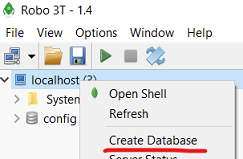
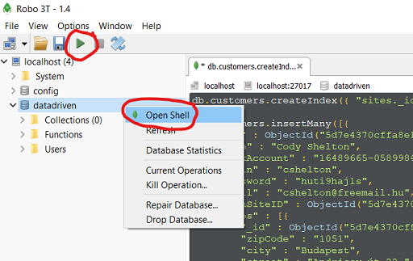

# MongoDB

The seminar's goal is to understand the concepts of the _MongoDB_ document database and the usage of the _MongoDB C#/.NET Driver_.

## Pre-requisites

Required tools to complete the tasks:

- Microsoft Visual Studio 2019 (_not_ VS Code)
- MongoDB Community Edition
- Robo 3T
- Database initialization script: [mongo.js](https://raw.githubusercontent.com/bmeviauac01/adatvezerelt/master/docs/db/mongo.js)
- Starter code: <https://github.com/bmeviauac01/gyakorlat-mongo-kiindulo>

Recommended to review:

- C# language and Linq queries
- MongoDB lecture
- [Using MongoDB guide](../../db/mongodb.md)

## How to work during the seminar

The exercises are solved together with the instructor. A few exercises we can try to solve by ourselves and then discuss the results. The final exercise is individual work if time permits.

!!! info ""
    This guide summarizes and explains the behavior. Before looking at these provided answers, we should think first!

## Exercise 0: Create database, open starter code

1. Open a _PowerShell_ console (search for PowerShell in the Start menu and start it, but _not_ the one with "ISE" in the same - that is not the console).

1. Copy and paste the script into the console and run it by pressing enter.

    ```powershell
    Remove-Item c:\work\mongodatabase -Recurse -ErrorAction Ignore
    New-Item -Type Directory c:\work\mongodatabase
    c:\tools\mongodb-win32-x86_64-windows-4.4.10\bin\mongod.exe --dbpath c:\work\mongodatabase
    ```

    Keep this window open because the server is running here. You can stop it by pressing Ctrl+C at the end of the class.

1. Launch Robo3, which you find in directory `c:\tools\robo3t...` and connect to the MongoDB server.

    

1. Let us create a new database by right-clicking the connection (_localhost_). Let the database name be `datadriven`.

    

1. Open a new shell into the database by right-clicking it and choosing the _Open Shell_ command. This will open a single-line textbox to the right. Copy the database initialization script from [here](https://raw.githubusercontent.com/bmeviauac01/adatvezerelt/master/docs/db/mongo.js) into the textbox and execute it by pressing the green play button on the toolbar. This will create our collections - expand the _Collections_ item to check them.

    

1. Download the starter solution!

    - Open a **new** _command prompt_ or PowerShell console (do not use the one the server is running in)
    - Navigate to a folder, e.g. `c:\work\NEPTUN`
    - Execute the following command: `git clone --depth 1 https://github.com/bmeviauac01/gyakorlat-mongo-kiindulo.git`

1. Open the _sln_ file from the newly created folder using Visual Studio. Let us examine this project.

    - This is a .NET Core console application. The structure resembles the structure of the Entity Framework project seen before: directory `Entities` contains the database entities while our code will be written into `Program.cs`.
    - `Program.cs` already contains the initialization of the connection to MongoDB.
        - Interface `IMongoClient` is used for all communication with the database. We will not use this directly.
        - Interface `IMongoDatabase` represents the database `datadriven` within the MongoDB server.
        - And the `IMongoCollection<TEntity>` interfaces represent the specific collections we can use to execute queries and modification commands.
    - The database documents are mapped to the C# entity classes in folder `Entities`. A major difference compared to the behavior previously seen in Entity Framework is that these classes were not generated by written manually.
        - Most entities are already mapped.
        - We will create one more class during an exercise.

## Exercise 1: Queries

Write C# code using the _MongoDB C#/.NET Driver_ in the following exercises. Print the results to the console.

1. List the names and the amount of stock of all products that we have more than 30 in stock!

1. List the orders that consist of at least two items!

1. List the orders that have a total value of at least 30.000! For each order, print the customer name, and list all items of the order (with the product name, amount, and price).

1. Find the most expensive product!

1. List the products that have been ordered at least twice!

??? example "Solution"
    1. We need only the product collection and execute a simple query. The filter criteria can be written as a Lambda-expression and with the builder syntax too.

        ```csharp
        Console.WriteLine("***** Exercise one *****");

        // 1.1 first solution
        Console.WriteLine("\t1.1 First solution:");
        var qProductAndStock1 = productsCollection
            .Find(p => p.Stock > 30)
            .ToList();

        foreach (var p in qProductAndStock1)
            Console.WriteLine($"\t\tName={p.Name}\tStock={p.Stock}");

        // 1.1 second solution
        Console.WriteLine("\t1.1 Second solution:");
        var qProductAndStock2 = productsCollection
            .Find(Builders<Product>.Filter.Gt(p => p.Stock, 30))
            .ToList();

        foreach (var p in qProductAndStock2)
            Console.WriteLine($"\t\tName={p.Name}\tStock={p.Stock}");
        ```

    1. This is similar to the previous one. We may note that we would have needed a join in a relational database, but we have everything at hand here.

        ```csharp
        // 1.2 first solution
        Console.WriteLine("\t1.2 First solution:");
        var qOrderItems1 = ordersCollection
            .Find(o => o.OrderItems.Length >= 2)
            .ToList();

        foreach (var o in qOrderItems1)
            Console.WriteLine($"\t\tCustomerID={o.CustomerID}\tOrderID={o.ID}\tItems={o.OrderItems.Length}");

        // 1.2 second solution
        Console.WriteLine("\t1.2 Second solution:");
        var qOrderItems2 = ordersCollection
            .Find(Builders<Order>.Filter.SizeGte(o => o.OrderItems, 2))
            .ToList();

        foreach (var o in qOrderItems2)
            Console.WriteLine($"\t\tCustomerID={o.CustomerID}\tOrderID={o.ID}\tItems={o.OrderItems.Length}");
        ```

    1. A simple query is not sufficient for this exercise; thus, we need the aggregation pipeline. We may still note that every information we need is still available in one collection.

        ```csharp
        // 1.3
        Console.WriteLine("\t1.3:");
        var qOrderTotal = ordersCollection
            .Aggregate()
            .Project(order => new
            {
                CustomerID = order.CustomerID,
                OrderItems = order.OrderItems,
                Total = order.OrderItems.Sum(oi => oi.Amount * oi.Price)
            })
            .Match(order => order.Total > 30000)
            .ToList();

        foreach (var o in qOrderTotal)
        {
            Console.WriteLine($"\t\tCustomerID={o.CustomerID}");
            foreach (var oi in o.OrderItems)
                Console.WriteLine($"\t\t\tProductID={oi.ProductID}\tPrice={oi.Price}\tAmount={oi.Amount}");
        }
        ```

    1. To find the most expensive product, we need two queries: first, find the largest price value, then find the products with this price.

        ```csharp
        // 1.4
        Console.WriteLine("\t1.4:");
        var maxPrice = productsCollection
            .Find(_ => true)
            .SortByDescending(p => p.Price)
            .Limit(1)
            .Project(p => p.Price)
            .Single();

        var qProductMax = productsCollection
            .Find(p => p.Price == maxPrice)
            .ToList();

        foreach (var t in qProductMax)
            Console.WriteLine($"\t\tName={t.Name}\tPrice={t.Price}");
        ```

    1. This exercise is complicated with our current database scheme because we do not have everything at hand within one collection. We need the product information from one collection, and the order details from another one.

        We will be doing a "join" in the client-side, that is, in C# code. The solution's outline is to query the orders, then in C# gather the orders by product, and finally, query the product details.

        ```csharp
        // 1.5
        Console.WriteLine("\t1.5:");
        var qOrders = ordersCollection
            .Find(_ => true)
            .ToList();

        var productOrders = qOrders
            .SelectMany(o => o.OrderItems) // All order items into one list
            .GroupBy(oi => oi.ProductID)
            .Where(p => p.Count() >= 2);

        var qProducts = productsCollection
            .Find(_ => true)
            .ToList();
        var productLookup = qProducts.ToDictionary(p => p.ID);

        foreach (var p in productOrders)
        {
            var product = productLookup.GetValueOrDefault(p.Key);
            Console.WriteLine($"\t\tName={product?.Name}\tStock={product?.Stock}\tOrders={p.Count()}");
        }
        ```

        This solution is very elegant and works only for small databases. Suppose we face a similar task under real-life circumstances. We have two choices: denormalize the database scheme and copy product details into the orders, or create an aggregation pipeline executed by the server that does something similar to the code above (MongoDB can do that, but it will not be very fast).

## Exercise 2: Create a new entity class

1. Examine the classes `Product` and `VAT`. Why is there a field with a `[BsonId]` attribute in class `Product` and not in class `VAT`?

1. Create a new entity class for mapping `Category` document, then add and initialize a `IMongoCollection<Category>` field next to the others.

??? example "Solution"
    1. Class `Product` represents the `products` collection; therefore each item has a unique `ObjectID`. On the other hand, class `VAT` is an embedded field used by `Product` and has no collection on its own; hence it needs no id.

    1. Create our new `Category` POCO class.

        Let us check a few sample documents using Robo3T in `categories` collection.

        

        Create a new class `Category` in folder `Entities` with matching fields as below.

        ```csharp
        using MongoDB.Bson;
        using MongoDB.Bson.Serialization.Attributes;

        namespace BME.DataDriven.Mongo.Entitites
        {
            public class Category
            {
                [BsonId]
                public ObjectId ID { get; set; }
                public string Name { get; set; }
                public ObjectId? ParentCategoryID { get; set; }
            }
        }
        ```

        Add a new collection interface field in `Program.cs` as follows.

        ```csharp
        private static IMongoCollection<Category> categoriesCollection;
        ```

        And assign the value in the `initialize` method to get the collection.

        ```csharp
        categoriesCollection = database.GetCollection<Category>("categories");
        ```

## Exercise 3: Data modification

The collection classes `IMongoColection<TEntity>` can also be used to execute modification operations.

1. Write C# code that increases the price of all products in category "LEGO" by 10 percent!

1. Create a new category named _Expensive toys_ and move all products here that cost more than 8000!

1. Delete all categories that contain no products.

??? example "Solution"
    1. Find the ID of the category then update all products that have this category id.

        ```csharp
        Console.WriteLine("***** Exercise three *****");

        //3.1
        Console.WriteLine("\t3.1:");
        var categoryLegoId = categoriesCollection
            .Find(c => c.Name == "LEGO")
            .Project(c => c.ID)
            .Single();

        var qProductLego = productsCollection
            .Find(p => p.CategoryID == categoryLegoId)
            .ToList();
        Console.WriteLine("\t\tBefore modification:");
        foreach (var p in qProductLego)
            Console.WriteLine($"\t\t\tName={p.Name}\tStock={p.Stock}\tÁr={p.Price}");

        productsCollection.UpdateMany(
            filter: p => p.CategoryID == categoryLegoId,
            update: Builders<Product>.Update.Mul(p => p.Price, 1.1));

        qProductLego = productsCollection
            .Find(p => p.CategoryID == categoryLegoId)
            .ToList();
        Console.WriteLine("\t\tAfter modification:");
        foreach (var p in qProductLego)
            Console.WriteLine($"\t\t\tName={p.Name}\tStock={p.Stock}\tÁr={p.Price}");
        ```

    1. MongoDB can execute the following sequence of steps in a single atomic step: "Get me category `Expensive toys`. If it does not exist, create it." We will use `FindOneAndUpdate` to achieve this.

        ```csharp
        //3.2
        Console.WriteLine("\t3.2:");
        var catExpensiveToys = categoriesCollection.FindOneAndUpdate<Category>(
            filter: c => c.Name == "Expensive toys",
            update: Builders<Category>.Update.SetOnInsert(c => c.Name, "Expensive toys"),
            options: new FindOneAndUpdateOptions<Category, Category> { IsUpsert = true, ReturnDocument = ReturnDocument.After });

        productsCollection.UpdateMany(
            filter: p => p.Price > 8000,
            update: Builders<Product>.Update.Set(p => p.CategoryID, catExpensiveToys.ID));

        var qProdExpensive = productsCollection
            .Find(p => p.CategoryID == catExpensiveToys.ID)
            .ToList();
        foreach (var p in qProdExpensive)
            Console.WriteLine($"\t\tName={p.Name}\tPrice={p.Price}");
        ```

    1. Query categories that contain any product, then delete the ones that do not belong among this list.

        ```csharp
        //3.3
        Console.WriteLine("\t3.3:");
        Console.WriteLine($"\t\tBefore modification: {categoriesCollection.CountDocuments(_ => true)} categories");

        var qProductCategory = new HashSet<ObjectId>(
            productsCollection
                .Find(_ => true)
                .Project(p => p.CategoryID)
                .ToList());

        categoriesCollection.DeleteMany(c => !qProductCategory.Contains(c.ID));

        Console.WriteLine($"\t\tAfter modification: {categoriesCollection.CountDocuments(_ => true)} categories");
        ```

        Let us note that this is not an atomic operation. If a product was added concurrently, we could have deleted its category.
